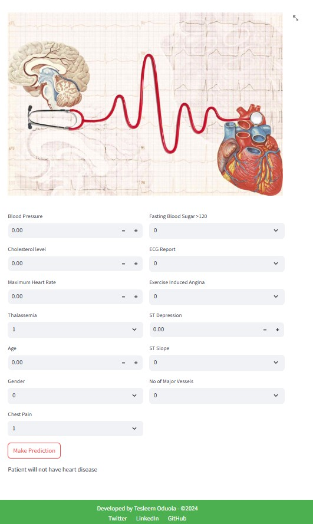

# Heart Disease Prediction Using Health Indices

## Table of Contents
- [Project Overview](#project-overview)
- [Project Objective](#project-objective)
- [Data Source](#data-source)
- [Data Preprocessing](#data-preprocessing)
- [Model Building](#model-building)
- [Feature Importance](#feature-importance)
- [Model Evaluation](#model-evaluation)
- [Model Deployment](#model-deployment)

## Project Overview
Customer churn (also called customer attrition or customer turnover) is the percentage of customers that stopped 
using a company's product or service (for any reason) within a specified timeframe. This is one of the biggest 
expenditures for organizations. The purpose of this project was to develop an effective Machine Learning model 
to identify customers at risk of churning. By applying advanced analytics and machine learning techniques to the 
provided dataset, the goal is to offer actionable recommendations to the company, enabling them to implement targeted 
retention strategies. This will help reduce customer attrition, enhance customer loyalty, and maintain a competitive 
edge over in the industry.

## Project Objective
The goal is to accurately predict which customers are likely to churn (i.e., discontinue their services) by analyzing 
historical customer data. Also, to identify the key indicators of churn and recommend retention strategies.

## Data Source
The dataset for this project was sourced from Kaggle. It includes various features such as gender, SeniorCitizen status,
Partner, Dependents, tenure, PhoneService, MultipleLines, InternetService, OnlineSecurity, OnlineBackup, DeviceProtection, 
TechSupport, StreamingTV, StreamingMovies, Contract type, PaperlessBilling, PaymentMethod, MonthlyCharges, TotalCharges, 
and Churn. The target variable is Churn, where 1 represents churned, and 0 represents not churned

## Data Preprocessing
Data preprocessing was done to prepare the data for modelling
- **Handle missing values**: Ensured that all missing values in the dataset were properly addressed.
- **Remove duplicates**: Checked for duplicate values to avoid redundancy. 1 duplicate was found in the datasetand it was dropped
- **Scale numerical variables with outliers**: resting_blood_pressure, cholesterol, max_heart_rate_achieved, and thalassemia were scaled to ensure consistent scaling.

## Model Building
Eight machine learning classifiers:
-Logistic Regression
-SGD Classifier
-K-Nearest Neighbors (KNN)
-Random Forest Classifier
-Support Vector Machine (SVM)
-Naive Bayes
-Decision Tree 
- XGBoost were imported
The classifiers were trained on the training dataset, and evaluated on the test subset of the dataset.

## Feature Importance
The following table lists the importance scores of various features used in the model. Higher positive values indicate greater importance 
in the model's predictions, while negative values suggest a lesser contribution or inverse relationship.

- **High Positive Scores**: Features like age, ST depression, and chest pain type are crucial for the model's predictions and should be prioritized in clinical settings.
- **Moderate Scores**: Number of major vessels and exercise-induced angina have a moderate impact and are important but not as critical as the top features.
- **Low or Negative Scores**: resting blood pressure, cholesterol, and fasting blood sugar have minimal impact on predictions and might be less significant for the model.

Overall, age, ST depression, and chest pain are the most influential, while resting blood pressure, cholesterol and fasting blood sugar have less impact or a negative influence.

## Model Evaluation
The performance of the models was evaluated on the test dataset using metrics such as accuracy, precision, recall, and F1-score.
Below is a screenshot of the evaluation reports and Naive bayes confusion matrix from the notebook:

## Model Deployment
The model was deployed using Streamlit

